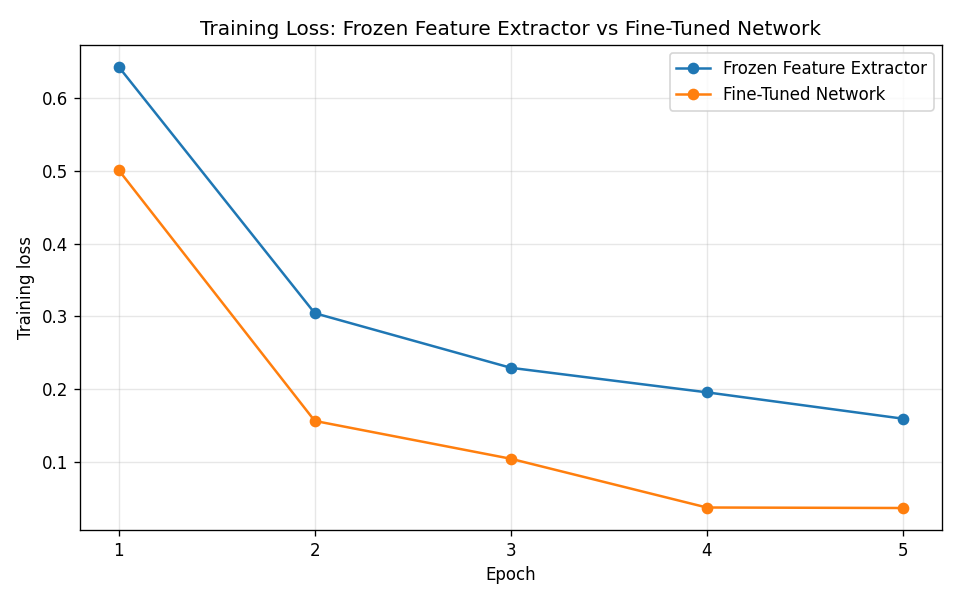

# CS5720 Neural Network and Deep Learning: Home Assignment 3

## Student Information

- **Name:** Simran Koul
- **Student ID:** 700809605
- **Course:** CS5720 Neural Network and Deep Learning (CS-5720-11833)
- **Semester:** Fall 2026
- **Assignment:** Home Assignment 3, Part II (Programming)
- **University:** University of Central Missouri, Department of Computer Science & Cybersecurity

---

## Overview

This branch contains the Part II programming solutions for Home Assignment 3.
Each question is a standalone, commented Python script in the
[`Home-Assignment-3/`](Home-Assignment-3/) folder.

| File | Question | Topic |
| --- | --- | --- |
| [`q1_convolution_from_scratch.py`](Home-Assignment-3/q1_convolution_from_scratch.py) | Q1 | 2-D convolution implemented without a built-in convolution function |
| [`q2_transfer_learning.py`](Home-Assignment-3/q2_transfer_learning.py) | Q2 | Transfer learning with ResNet50: frozen feature extraction vs fine-tuning |

---

## Requirements

```bash
pip install numpy tensorflow matplotlib
```

Question 1 needs only NumPy. Question 2 downloads the pretrained ResNet50
weights (about 95 MB) and the `flower_photos` dataset (about 218 MB) on first
run, so it needs an internet connection the first time. Both are cached
afterwards.

## How to Run

The scripts live in `Home-Assignment-3/`, so run them from there:

```bash
cd Home-Assignment-3

python q1_convolution_from_scratch.py
python q2_transfer_learning.py
```

Question 1 finishes instantly. Question 2 trains two models and accepts an
`EPOCHS` environment variable for a quicker run:

```bash
EPOCHS=1 python q2_transfer_learning.py
```

---

## Question 1: Implement Convolution from Scratch

### Input

```text
Input matrix (5x5)        Filter (3x3)
 1  1  1  0  0             1  0  1
 0  1  1  1  0             0  1  0
 0  0  1  1  1             1  0  1
 0  0  1  1  0
 0  1  1  0  0
```

Stride = 1, padding = 0.

### Approach

No built-in convolution function is used. `convolve2d()` does the work with two
plain Python loops:

1. **(a) NumPy storage** - the input and filter are `np.array` objects built by
   `build_input_matrix()` and `build_filter()`.
2. **(b) Sliding the filter** - the two loops walk the top-left corner of the
   window across the input. The loop counters are multiplied by the stride,
   which is what makes a larger stride skip positions.
3. **(c) Dot product** - at each location the patch sitting under the filter is
   sliced out and combined with `np.sum(region * kernel)`, an element-by-element
   multiply followed by a sum.
4. **(d) and (e)** - the feature map and its shape are printed.

The output size comes from the standard formula, with integer division
discarding any position where the filter would hang off the edge:

```text
output_size = (N - F + 2P) / S + 1
```

### Output Feature Map

**Stride = 1, Padding = 0** -> shape **3 x 3**

```text
  4   3   4
  2   4   3
  2   3   4
```

Worked example for the top-left value: the window covers

```text
1 1 1        1 0 1
0 1 1   .*   0 1 0   ->  (1+0+1) + (0+1+0) + (0+0+1)  =  4
0 0 1        1 0 1
```

This result was cross-checked against `tf.nn.conv2d` and matches exactly. The
check is valid here because this particular filter is symmetric under a
180-degree rotation, so true convolution and the cross-correlation that
frameworks actually compute give the same answer.

### (f) Effect of changing the stride from 1 to 2

The script also computes the stride 2 result so the explanation can point at
real numbers:

**Stride = 2, Padding = 0** -> shape **2 x 2**

```text
  4   4
  2   4
```

The stride is how far the filter moves between positions. At stride 1 the
window shifts one column at a time and visits every valid location, giving a
3 x 3 output. At stride 2 it skips every other position, starting only at rows
and columns 0 and 2, giving a 2 x 2 output. The same formula predicts both:
`(5 - 3) / 1 + 1 = 3` and `(5 - 3) / 2 + 1 = 2`.

A larger stride downsamples the feature map. That cuts computation and memory
in the following layer and widens the receptive field of later layers, at the
cost of spatial detail, since positions the filter skipped are never measured.

Worth noticing in the two outputs above: the stride 2 map is not a summary or
an average of the stride 1 map, it is a literal **subset** of it. Every value
in the 2 x 2 result (4, 4, 2, 4) appears in the 3 x 3 result at the corners
that both strides happened to visit. Striding discards measurements rather than
combining them, which is exactly what distinguishes it from pooling.

---

## Question 2: Transfer Learning, Freeze vs Fine-Tune

### Setup

| Item | Value |
| --- | --- |
| Pretrained model | ResNet50, ImageNet weights, `include_top=False` |
| Dataset | `flower_photos`, 5 classes (daisy, dandelion, roses, sunflowers, tulips) |
| Split | 2,936 training images / 734 validation images (80/20, seed 42) |
| Input size | 224 x 224 x 3 |
| Batch size | 32 |
| Epochs | 5 for both experiments |

Images go through `resnet50.preprocess_input` rather than a plain 0-1 rescale,
because ResNet50 was trained with its own channel scaling. Both experiments use
the identical classification head: global average pooling, 20% dropout, then a
`Dense(5, softmax)` layer.

### Experiment A: Frozen Feature Extractor

`base.trainable = False` freezes all 23.6M convolution weights, so the
pretrained network acts purely as a fixed feature extractor and only the new
classifier learns. Learning rate 1e-3.

### Experiment B: Fine-Tuned Network

The base is loaded the same way, then only the `conv5_*` layers (the last
residual block) are unfrozen, along with the classifier. Everything earlier
stays frozen, preserving the general edge and texture filters.

Two deliberate choices here:

- **BatchNorm layers stay frozen even inside conv5.** Updating their running
  statistics on a few thousand images is a well-known way to damage a
  pretrained network, so they are kept in inference mode.
- **Learning rate 1e-4, ten times smaller than Experiment A.** Experiment A
  only trains a randomly initialised head, so it can take a normal rate.
  Experiment B updates pretrained convolution weights, which a large rate would
  destroy. This is a necessary property of fine-tuning rather than an attempt
  to make the comparison look a particular way.

### (f) Comparison

| Method | Trainable Parameters | Training Time | Accuracy |
| --- | --- | --- | --- |
| Frozen Feature Extractor | 10,245 | 367.4 s | 0.9074 |
| Fine-Tuned Network | 14,963,717 | 459.8 s | 0.9183 |

Supporting numbers:

| Method | Non-trainable params | Validation loss | Final training loss |
| --- | --- | --- | --- |
| Frozen Feature Extractor | 23,587,712 | 0.3274 | about 0.16 |
| Fine-Tuned Network | 8,634,240 | 0.4452 | about 0.03 |

### (e) Training Loss



The fine-tuned network starts lower and falls much faster, flattening near 0.03
by epoch 4. The frozen extractor descends more gently and levels off around
0.16. That ordering is expected: the fine-tuned model has roughly 1,460 times
more trainable parameters, so it has far more capacity to fit the training set.

### (g) Discussion

The frozen feature extractor trains only 10,245 parameters while the fine-tuned
network trains 14,963,717, about 1,460 times more, because the first updates a
single dense layer and the second also updates the whole conv5 residual block.
That gap explains the difference in training time: both models run the same
forward pass, but the frozen model needs gradients only for the last layer,
whereas the fine-tuned model has to backpropagate through the final block and
hold those activations in memory, which cost it 459.8 s against 367.4 s. The
saving from freezing would be larger still if more of the network were
unfrozen. Accuracy moves for a different reason: ImageNet features are already
close to what flower photos need, so a linear classifier on frozen features is
a strong baseline at 90.74% and gets most of the way there on its own.
Fine-tuning edged ahead to 91.83% because the last block holds the most
task-specific features, and letting those adapt lets the network re-tune what
it treats as discriminative for flowers rather than for ImageNet classes. The
gain was small, though, and the extra capacity came at a cost that the accuracy
column hides. In short, freezing is faster and safer on a small dataset, while
fine-tuning costs more time and needs more care but has the higher ceiling when
the new task differs more from the pretraining task than flowers do from
ImageNet.

### A result worth noticing

The fine-tuned network has **higher accuracy but worse validation loss**
(0.4452 against 0.3274), while its training loss is five times lower. Those
three facts together are a textbook overfitting signature: the model is fitting
the training set almost perfectly, and although it still gets slightly more
validation images right, it has become overconfident on the ones it gets wrong,
which is what drives cross-entropy up.

This is the practical argument for the two safeguards described above. It also
suggests that on this dataset the extra 92 seconds of training buys about one
percentage point of accuracy, so the frozen extractor is arguably the better
engineering choice here. Fine-tuning pays off more clearly when the target
domain is further from ImageNet, such as medical or satellite imagery, where
the pretrained features genuinely need to change.

---

## Output Files

Running the scripts produces this inside `Home-Assignment-3/`:

- `q2_training_loss.png` - training loss curves for both experiments

Question 1 prints everything to the terminal and writes no files.
